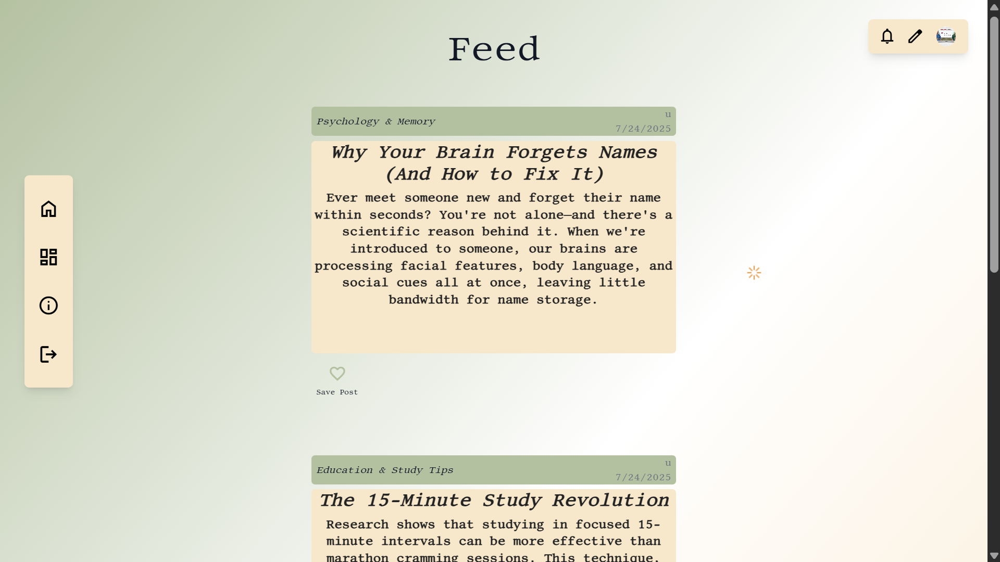
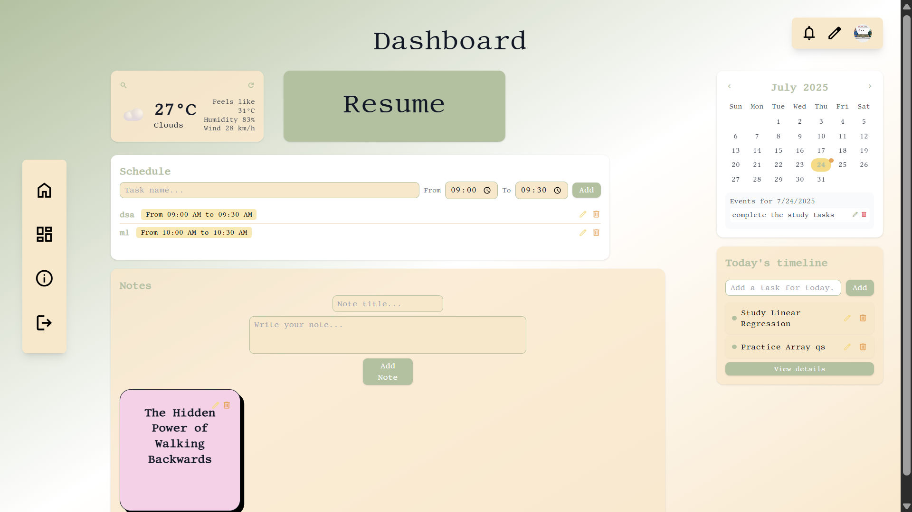
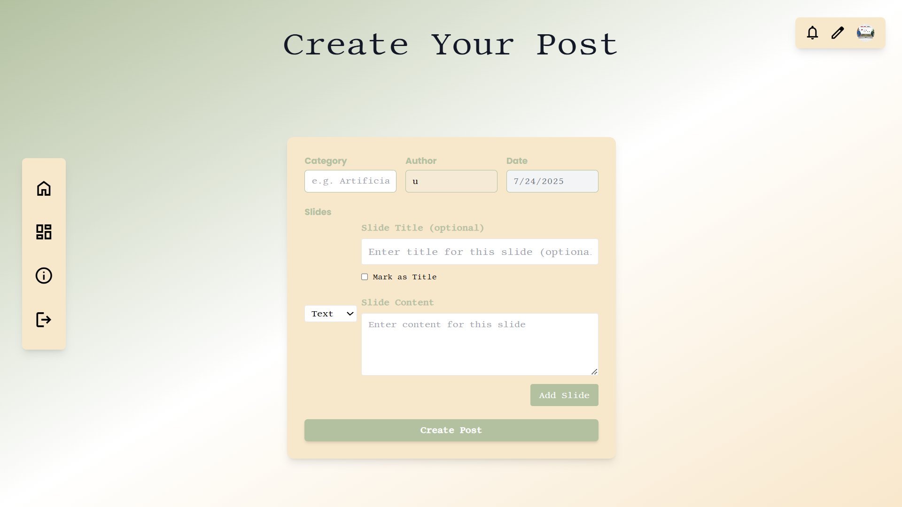
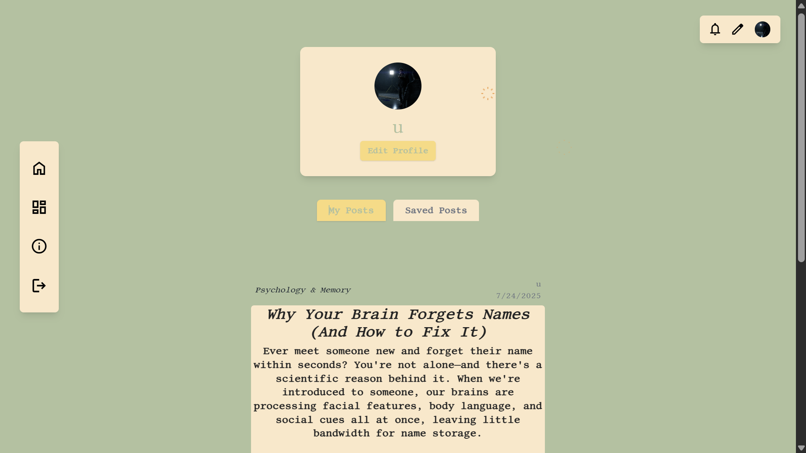
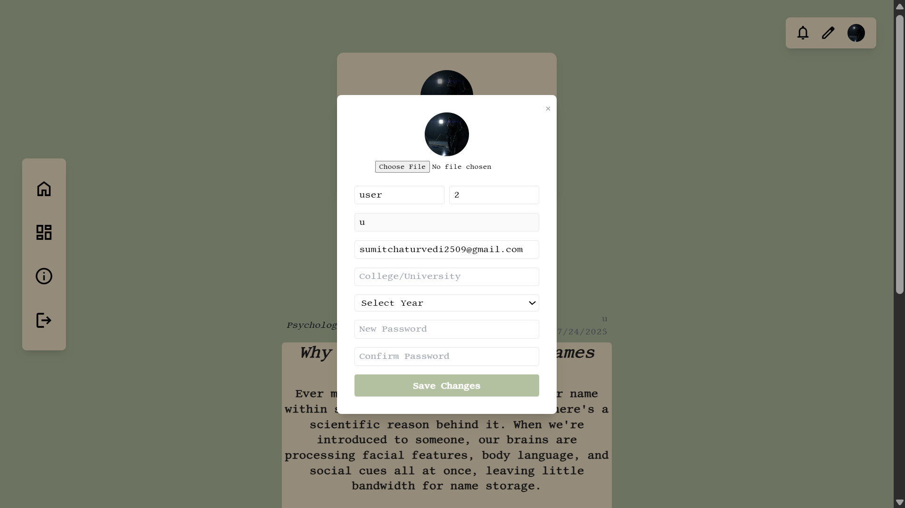
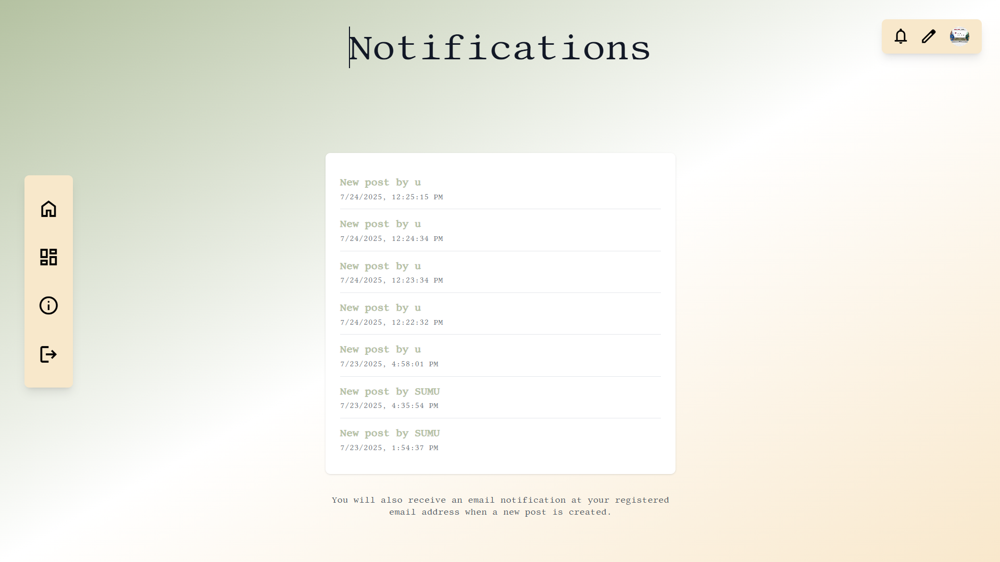
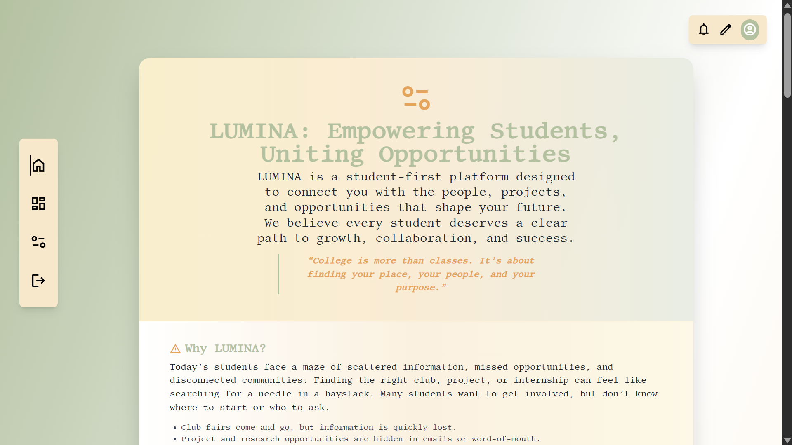
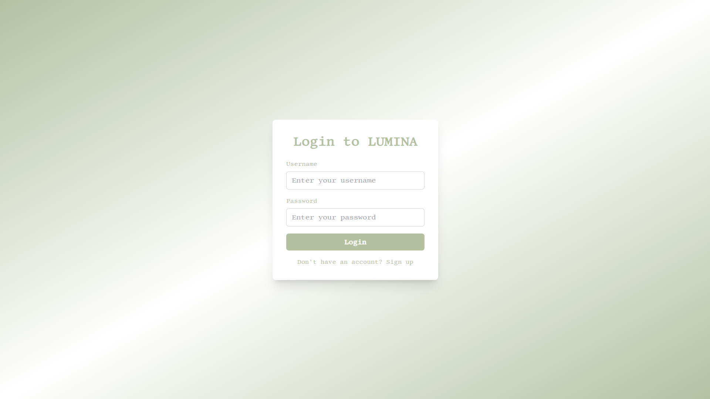
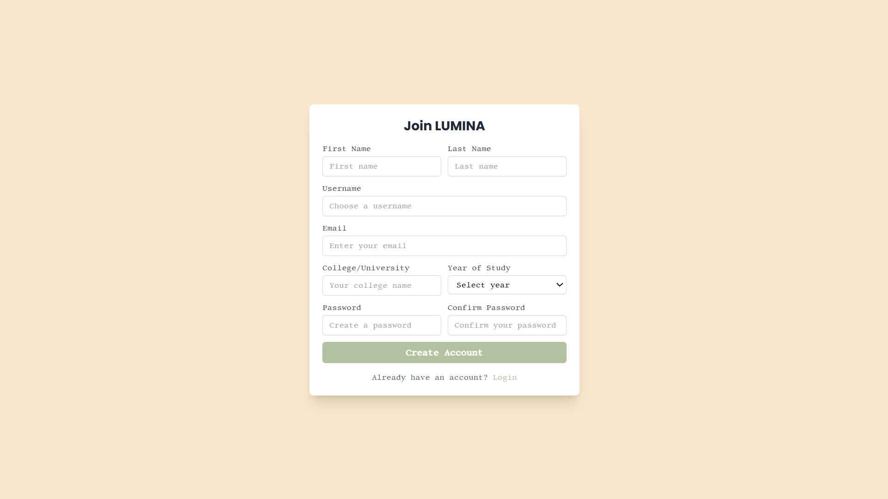

# LUMINA - Student Productivity Platform

<div align="center">


**A comprehensive student productivity platform designed to enhance academic life through intelligent task management, scheduling, and content creation.**

[](https://reactjs.org/)
[](https://nodejs.org/)
[](https://mongodb.com/)
[](https://www.typescriptlang.org/)
[](https://tailwindcss.com/)

</div>

## 🎯 Mission

LUMINA aims to revolutionize student productivity by providing an all-in-one platform that combines task management, scheduling, content creation, and real-time collaboration. Built with modern technologies and intuitive design, it helps students stay organized, focused, and productive throughout their academic journey.


## 📱 Website Screenshots

### 🟣 Landing Page  
  
*A visually striking landing page with animated backgrounds and spark effects.*

---

### 🟢 Home Feed  
  
*Scroll-based content feed featuring multi-slide posts and interactive UI.*

---

### 🔵 Dashboard  
  
*Central hub showing timelines, productivity stats, and widgets like weather, focus mode, etc.*

---

### 🟠 New Post  
  
*Slide-based post creation tool supporting text, images, and voice notes.*

---

### 🟡 Profile Page  
  
*User profile with personalization, saved content, and daily insights.*

---

### 🧡 Edit Profile  
  
*Update user details, preferences, and avatar.*

---

### 🟤 Notifications  
  
*Real-time alerts for productivity goals, reminders, and interactions.*

---

### 🔴 About Page  
  
*Overview of LUMINA’s vision, features, and development journey.*

---

### ⚪ Login Page  
  
*Secure login interface with modern aesthetics.*

---

### ⚫ Signup Page  
  
*Quick onboarding with clean form design.*


## ✨ Features

### 🏠 **Core Platform**
- **Landing Page**: Beautiful, animated landing experience with spark effects
- **User Authentication**: Secure login/signup system with JWT tokens
- **Responsive Design**: Mobile-first approach with Tailwind CSS
- **Real-time Updates**: Live data synchronization across components

### 📝 **Content Management**
- **Post Creation**: Multi-slide content creation with image and text support
- **Content Discovery**: Browse and explore posts from other users
- **Save & Organize**: Save interesting posts for later reference
- **Author Profiles**: View content by specific authors

### 📊 **Dashboard & Productivity**
- **Interactive Dashboard**: Centralized productivity hub
- **Timeline Todo**: Animated task management with drag-and-drop
- **Schedule Management**: Visual calendar with event scheduling
- **Notes Section**: Academic note-taking and organization
- **Weather Widget**: Real-time weather information with location search
- **Interactive Calendar**: Full-featured calendar component

### 🎨 **User Experience**
- **Animated Components**: Smooth animations using Framer Motion and GSAP
- **Click Spark Effects**: Interactive spark animations on user interactions
- **Blur Text Effects**: Modern text blur animations
- **Fade Content**: Elegant content transitions
- **Top Right Tools**: Quick access toolbar

### 👤 **User Management**
- **Profile Management**: Complete user profile customization
- **Notifications System**: Real-time notification handling
- **College Integration**: College and year tracking
- **Profile Images**: Custom avatar support

## 🛠 Tech Stack

### Frontend
- **React 19.1.0** - Modern React with latest features
- **React Router DOM 7.6.3** - Client-side routing
- **Framer Motion 12.23.5** - Advanced animations
- **GSAP 3.13.0** - Professional animation library
- **Tailwind CSS 3.4.0** - Utility-first CSS framework
- **React Time Picker 7.0.0** - Time selection components
- **Slick Carousel** - Image carousel functionality

### Backend
- **Node.js** - JavaScript runtime
- **Express.js 5.1.0** - Web application framework
- **TypeScript 5.8.3** - Type-safe JavaScript
- **MongoDB 8.16.3** - NoSQL database
- **Mongoose** - MongoDB object modeling
- **JWT 9.0.2** - JSON Web Token authentication
- **bcryptjs 3.0.2** - Password hashing
- **CORS 2.8.5** - Cross-origin resource sharing
- **Nodemailer 7.0.5** - Email functionality

### Development Tools
- **Nodemon** - Development server with auto-restart
- **ts-node** - TypeScript execution
- **PostCSS & Autoprefixer** - CSS processing

## 📁 Project Structure

```
LUMINA/
├── frontend/                 # React frontend application
│   ├── public/              # Static assets
│   │   ├── LUMINA.png       # Main background image
│   │   └── LUMINA_logo.png  # Project logo
│   ├── src/
│   │   ├── components/      # Reusable UI components
│   │   │   ├── AnimatedContent.js
│   │   │   ├── BlurText.js
│   │   │   ├── ClickSpark.js
│   │   │   ├── FadeContent.js
│   │   │   ├── InteractiveCalendar.js
│   │   │   ├── Navbar.js
│   │   │   ├── NotesSection.js
│   │   │   ├── ScheduleSection.js
│   │   │   ├── TimelineTodo.js
│   │   │   ├── TopRightTools.js
│   │   │   └── WeatherWidget.js
│   │   ├── pages/          # Application pages
│   │   │   ├── AboutPage.js
│   │   │   ├── DashboardPage.js
│   │   │   ├── HomePage.js
│   │   │   ├── landingPage.js
│   │   │   ├── LoginPage.js
│   │   │   ├── NotificationsPage.js
│   │   │   ├── PostFormPage.js
│   │   │   ├── ProfilePage.js
│   │   │   └── SignupPage.js
│   │   ├── services/       # API services
│   │   │   └── api.js
│   │   ├── App.js          # Main application component
│   │   └── index.js        # Application entry point
│   ├── package.json        # Frontend dependencies
│   └── tailwind.config.js  # Tailwind configuration
├── server/                 # Node.js backend application
│   ├── src/
│   │   ├── models/         # Database models
│   │   │   ├── Post.ts
│   │   │   └── User.ts
│   │   ├── routes/         # API routes
│   │   │   ├── auth.ts
│   │   │   └── posts.ts
│   │   └── index.ts        # Server entry point
│   ├── package.json        # Backend dependencies
│   └── tsconfig.json       # TypeScript configuration
└── README.md              # Project documentation
```

## 🚀 Quick Start

### Prerequisites
- **Node.js** (v16 or higher)
- **MongoDB** (local installation or MongoDB Atlas)
- **npm** or **yarn** package manager

### Installation

1. **Clone the repository**
```bash
git clone <repository-url>
cd LUMINA
```

2. **Install backend dependencies**
```bash
cd server
npm install
```

3. **Install frontend dependencies**
```bash
cd ../frontend
npm install
```

4. **Environment Setup**

Create `.env` file in the server directory:
```bash
cd ../server
cp .env.example .env
# Edit .env with your configuration:
# MONGODB_URI=your_mongodb_connection_string
# JWT_SECRET=your_jwt_secret
# PORT=5000
```

5. **Start Development Servers**

Start the backend server:
```bash
cd server
npm run dev
```

Start the frontend development server:
```bash
cd frontend
npm start
```

The application will be available at:
- **Frontend**: http://localhost:3000
- **Backend API**: http://localhost:5000

## 🔧 Development

### Available Scripts

**Backend (server directory):**
```bash
npm run dev    # Start development server with nodemon
npm start      # Start production server
```

**Frontend (frontend directory):**
```bash
npm start      # Start development server
npm run build  # Build for production
npm test       # Run tests
npm run eject  # Eject from Create React App
```

### Database Setup
```bash
# Start MongoDB (if using local installation)
mongod

# The application will automatically create collections on first use
```

## 🎨 Design System

### Color Palette
- **Primary**: Custom BTG colors (btgcream, btggreen, btgyellow, btgorange)
- **Background**: Clean white and cream tones
- **Text**: Dark gray (#222) for readability
- **Accents**: Green and yellow for interactive elements

### Typography
- **Headers**: Bold, modern sans-serif
- **Body**: Clean, readable fonts
- **Interactive**: Hover effects and smooth transitions

### Animations
- **Framer Motion**: Page transitions and component animations
- **GSAP**: Advanced timeline animations
- **Click Sparks**: Interactive spark effects
- **Fade Effects**: Smooth content transitions

## 🔒 Security Features

- **JWT Authentication**: Secure token-based authentication
- **Password Hashing**: bcryptjs for password security
- **Input Validation**: Comprehensive data validation
- **CORS Protection**: Cross-origin request handling
- **Environment Variables**: Secure configuration management

## 🌟 Key Features in Detail

### Timeline Todo System
- Real-time task management with animations
- Drag-and-drop functionality
- Color-coded task categories
- Persistent storage with MongoDB
- Edit and delete with smooth transitions

### Weather Integration
- Real-time weather data from OpenWeatherMap API
- Location-based weather information
- Search functionality for different cities
- Auto-refresh every 30 minutes
- Beautiful weather icons and animations

### Schedule Management
- Interactive calendar interface
- Event creation and management
- Time-based scheduling
- Visual timeline representation
- Persistent schedule storage

### Content Creation
- Multi-slide post creation
- Image and text slide support
- Carousel navigation
- Author attribution
- Save and organize functionality

## 🤝 Contributing

We welcome contributions to LUMINA! Please follow these steps:

1. **Fork the repository**
2. **Create a feature branch** (`git checkout -b feature/amazing-feature`)
3. **Commit your changes** (`git commit -m 'Add amazing feature'`)
4. **Push to the branch** (`git push origin feature/amazing-feature`)
5. **Open a Pull Request**

### Development Guidelines
- Follow the existing code style and structure
- Add appropriate TypeScript types for new features
- Include error handling and loading states
- Test your changes thoroughly
- Update documentation as needed

## 📄 License

This project is licensed under the MIT License - see the [LICENSE](LICENSE) file for details.

## 🆘 Support

For support and questions:
- **Email**: support@lumina-platform.com
- **Issues**: Create an issue on GitHub
- **Documentation**: Check the code comments and API documentation

## 🚀 Deployment

### Production Build
```bash
# Build frontend
cd frontend
npm run build

# Start production server
cd ../server
npm start
```

### Environment Variables
Ensure all required environment variables are set in production:
- `MONGODB_URI`: MongoDB connection string
- `JWT_SECRET`: Secret key for JWT tokens
- `PORT`: Server port (default: 5000)

---

<div align="center">

**Built with ❤️ for students, by students**

*LUMINA - Illuminate Your Academic Journey*

</div> 
